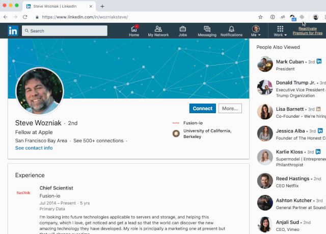

Nefarious LinkedIn
==================

  

This extension enables you to determine which extensions LinkedIn is scanning
your web browser for. This tool was created to accompany an original blog post
about this subject (check links below for more details).

Understanding which extensions LinkedIn is looking for can help keep your
LinkedIn account from being restricted or banned.

If you are an application developer, I highly recommend reading my personal blog
post to see how LinkedIn is searching for extensions and how you can prevent your
extension from being detected.

Related Links
-------------

- [Nefarious LinkedIn on the Web Store](https://chrome.google.com/webstore/detail/nefarious-linkedin/mpkhbmjfapljfhjopagghpfgbmghjpah)
- [Personal Blog Post](https://prophitt.me/articles/nefarious-linkedin)
- [Nymeria Blog Post](https://www.nymeria.io/blog/linkedins-war-on-email-finder-extensions-like-nymeria)

Creating a new build
--------------------

- Increment the manifest.json version number.
- Create a new build: `zip builds/manifest-version.zip -r extension`.
- Upload the new build to the Google web store.

License
-------

See [the license file](LICENSE.txt).
